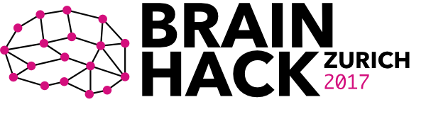

# Videos
Videos of the talks and tutorials can be found
[here](https://www.youtube.com/watch?v=iUJJzcEVf0k&list=PLYKzqqJI7cuSRN3g6rAQ553O2tJNTq9nx).

# Material for the talks and tutorials (will be updated continously)

## What is Brainhack
[\[slides\]](https://docs.google.com/presentation/d/1bt-sMmYbjCF5kzqH2pUcjRLLpQFtDOrxLRDr5BG6cMk/edit#slide=id.g1cf6b027c2_0_209)

## An Introduction to Python for Scientific Programming
[\[material\]](https://github.com/riccardomurri/python-for-science-intro)

Tutorials can be run via https://brainhack.cloud.s3it.uzh.ch (only requires a modern web browser -- must support web sockets; any recent version of Firefox or Google Chrome will do; Safari is not guaranteed to work). Login details will be provided during the tutorial.

## Science Cloud Introduction

[\[slides\]](https://github.com/DynAge/brainhack-zh/raw/master/misc/ScienceCloudIntroduction.pdf)

## Software virtualization
### Part 1: NeuroDebian - a computing platform for neuro- (and open) science
[\[slides\]](https://github.com/DynAge/brainhack-zh/raw/master/misc/NeuroDebianBrainhack_jo.pdf)

### Part 2: BIDS Apps and BIDS Apps on the Science Cloud
[\[slides\]](https://docs.google.com/presentation/d/1gMB3LyjEx7UtECKnSfrTcW9EqWvfSt6wL6KpJuypFn0/edit?usp=sharing)

## Automagic EEG toolbox
[\[example data\]](https://www.dropbox.com/s/ff4lx9m6mj871at/AutomagicData.zip?dl=0)

[\[Automagic slides\]](https://github.com/DynAge/brainhack-zh/blob/master/misc/Brainhack_Automagic_Final_compressed.pdf)

[\[microstate script\]](https://github.com/DynAge/brainhack-zh/blob/master/misc/MicrostateBrainHackSingle.m)
[\[microstate slides\]](https://github.com/DynAge/brainhack-zh/blob/master/misc/EEGMicrostates_slides.pdf)

EEGMicrostates_slides.pdf

Requires installing Matlab, [Automagic](https://github.com/amirrezaw/automagic),
[Microstate EEGlab toolbox](https://github.com/atpoulsen/Microstate-EEGlab-toolbox).

## Visualization

### Part 1: sweetView. a simple, quick, and powerful viewer for MRI images and SPM results

### Visualization Part 2: Plotting brain images with Nilearn
The tutorial will be provided as [IPython notebook](https://github.com/fliem/nilearn_tutorials/blob/master/2_0_visualization_of_brain_images_simple.ipynb).
It can be run locally (which requires installing IPython and Nilearn - I recommend doing this via the [anaconda distribution](http://www.continuum.io/downloads))
or **simpler and without installing anything** in [your browser](https://brainhack.cloud.s3it.uzh.ch).

## Nipype Tutorial – How to analyze your MRI data in an easy and flexible way
Requires [Docker](https://www.docker.com/products/overview) (free and without registration).

[material and instructions](https://github.com/miykael/nipype_course)

The notebooks for this tutorial are from the
[Nipype Tutorial](https://github.com/miykael/nipype_tutorial).
You can check out all the notebooks online on
[this homepage](https://miykael.github.io/nipype_tutorial/),
if you don't want to download and run the whole docker image yourself.

## Dynamic functional connectivity for dummies
[\[slides\]](http://miplab.epfl.ch/media/BrainHack.pdf)
[\[instructions\]](https://github.com/DynAge/brainhack-zh/blob/master/misc/Brainhack_dynConn_Instructions.pdf)
[\[solutions\]](https://github.com/DynAge/brainhack-zh/blob/master/misc/Brainhack_dynConn_Solutions.pdf)

Requires Matlab

# Brainhack Global 2017 Video Content
A list of video content from other Brainhack Global sites can be found
[here](https://hackpad.com/Brainhack-Global-2017-Video-Content-ZP53JJlhGyJ).
